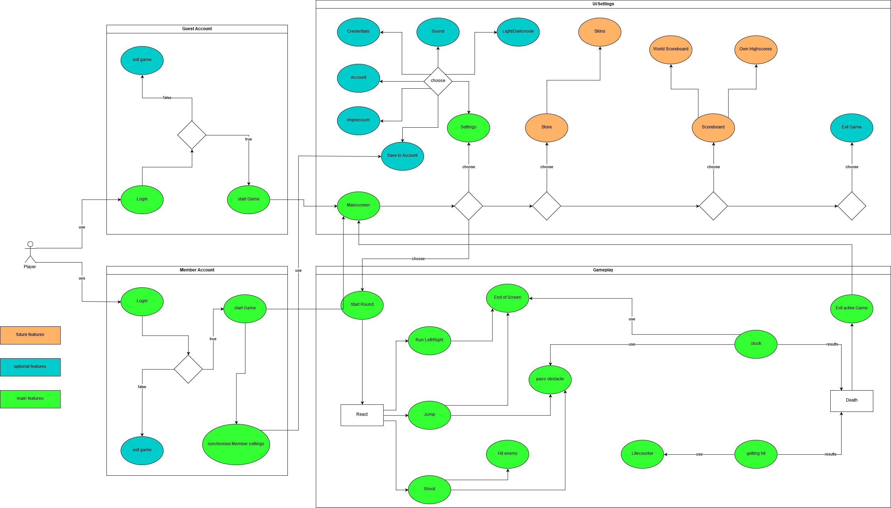

# Software Requirements Specification for Ted's Quest

Version 1.0

Revision History

| **Date** | **Version** | **Description** | **Author** |
| --- | --- | --- | --- |
| \&lt;dd/mmm/yy\&gt; | \&lt;x.x\&gt; | \&lt;details\&gt; | \&lt;name\&gt; |
|   |   |   |   |
|   |   |   |   |
|   |   |   |   |

# Table of Contents

1. [Introduction](#1-introduction)         
    1. [Purpose](#11-purpose)     
    2. [Scope](#12-scope)     
    3. [Definitions, Acronyms and Abbreviations](#13-definitions-acronyms-and-abbreviations)     
    4. [References](#14-references)     
    5. [Overview](#15-overview)     
2. [Overall Description](#2-overall-description)    
3. [Specific Requirements](#3-specific-requirements)
    1. [Functionality](#31-functionality)
        1. [Functional Requirement One](#311-functional-requirement-one>)        
    2. [Usability  ](#32-Usability)   
        1. [Usability Requirement One](#321-usability-requirement-one>)
    3. [Reliability](#33-reliability)     
        1. [Reliability Requirement One](#331-reliability-requirement-one>)
    4. [Performance](#34-performance)     
        1. [Performance Requirement One](#341-performance-requirement-one>)
    5. [Supportability](#35-supportability)     
        1. [Supportability Requirement One](#351-supportability-requirement-one>)
    6. [Design Constraints](#36-design-constraints)     
        1. [Design Constraint One](#361-design-constraint-one)
    7. [Online User Documentation and Help System Requirements](#37-on-line-user-documentation-and-help-system-requirements)
    8. [Purchased Components](#38-purchased-components)     
    9. [Interfaces](#39-interfaces)     
        1. [User Interfaces ](#391-user-interfaces)          
        2. [Hardware Interfaces](#392-hardware-interfaces)           
        3. [Software Interfaces](#393-software-interfaces)           
        4. [Communications Interfaces](#394-communications-interfaces)           
    10. [Licensing Requirements ](#310-licensing-requirements)    
    11. [Legal, Copyright and Other Notices](#311-legal-copyright-and-other-notices)     
    12. [Applicable Standards](#312-applicable-standards)  
4. [Supporting Information](#4-supporting-information)   

# 1. Introduction

[The introduction of the **Software Requirements Specification (SRS)** provides an overview of the entire **SRS**. It includes the purpose, scope, definitions, acronyms, abbreviations, references, and overview of the **SRS**.]

[Note: The **SRS** document captures the complete software requirements for the system, or a portion of the system.  Following is a typical **SRS** outline for a project using only traditional, natural-language style requirements—with **no use-case modeling.  ** It captures all requirements in a single document, with applicable sections inserted from the Supplementary Specifications (which would no longer be needed).  For a template of an **SRS** using use-case modeling, which consists of a package containing Use Cases of the use-case model and applicable Supplementary Specifications and other supporting information, see rup\_srsuc.dot.]

[Many different arrangements of an **SRS** are possible.  Refer to [IEEE830-1998] for further elaboration of these explanations, as well as other options for **SRS** organization.]

## 1.1 Purpose

[Specify the purpose of this **SRS**. The **SRS** fully describes the external behavior of the application or subsystem identified. It also describes nonfunctional requirements, design constraints, and other factors necessary to provide a complete and comprehensive description of the requirements for the software.]

## 1.2 Scope

[A brief description of the software application that the **SRS** applies to, the feature or other subsystem grouping, what Use-Case model(s) it is associated with, and anything else that is affected or influenced by this document.]

## 1.3 Definitions, Acronyms, and Abbreviations

[This subsection provides the definitions of all terms, acronyms, and abbreviations required to properly interpret the **SRS**.  This information may be provided by reference to the project&#39;s Glossary.]

## 1.4 References

[This subsection provides a complete list of all documents referenced elsewhere in the **SRS**.  Identify each document by title, report number if applicable, date, and publishing organization.  Specify the sources from which the references can be obtained. This information may be provided by reference to an appendix or to another document.]

## 1.5 Overview

[This subsection describes what the rest of the **SRS** contains and explains how the document is organized.]

# 2. Overall Description

[This section of the **SRS** describes the general factors that affect the product and its requirements.  This section does not state specific requirements.  Instead, it provides a background for those requirements, which are defined in detail in Section 3, and makes them easier to understand. Include such items as:

• product perspective

• product functions
blbb

•  user characteristics

• constraints

• assumptions and dependencies

• requirements subsets]

# 3. Specific Requirements

## 3.1 Functionality

[This section describes the functional requirements of the system for those requirements that are expressed in the natural language style. For many applications, this may constitute the bulk of the **SRS** package and thought should be given to the organization of this section. This section is typically organized by feature, but alternative organization methods may also be appropriate; for example, organization by user or organization by subsystem. Functional requirements may include feature sets, capabilities, and security.

Where application development tools, such as requirements tools, modeling tools, and the like, are employed to capture the functionality, this section of the document would refer to the availability of that data, indicating the location and name of the tool used to capture the data.]

### 3.1.1 Functional Requirement One

[The requirement description.]

## 3.2 Usability

[This section includes all those requirements that affect usability. For example,

- specify the required training time for a normal users and a power user to become productive at particular operations
- specify measurable task times for typical tasks or base the new system&#39;s usability requirements on other systems that the users know and like
- specify requirement to conform to common usability standards, such as IBM&#39;s CUA standards Microsoft&#39;s GUI standards]

### 3.2.1 Usability Requirement One

[The requirement description goes here.]

## 3.3 Reliability

[Requirements for reliability of the system should be specified here. Some suggestions follow:

- Availability—specify the percentage of time available ( xx.xx%), hours of use, maintenance access, degraded mode operations, and so on.
- Mean Time Between Failures (MTBF) — this is usually specified in hours, but it could also be specified in terms of days, months or years.
- Mean Time To Repair (MTTR)—how long is the system allowed to be out of operation after it has failed?
- Accuracy—specifies precision (resolution) and accuracy (by some known standard) that is required in the system&#39;s output.
- Maximum Bugs or Defect Rate—usually expressed in terms of bugs per thousand lines of code (bugs/KLOC) or bugs per function-point( bugs/function-point).
- Bugs or Defect Rate—categorized in terms of minor, significant, and critical bugs: the requirement(s) must define what is meant by a &quot;critical&quot; bug; for example, complete loss of data or a complete inability to use certain parts of the system&#39;s functionality.]

### 3.3.1 Reliability Requirement One

[The requirement description.]

## 3.4 Performance

[The system&#39;s performance characteristics are outlined in this section. Include specific response times. Where applicable, reference related Use Cases by name.

- Response time for a transaction (average, maximum)
- Throughput, for example, transactions per second
- Capacity, for example, the number of customers or transactions the system can accommodate
- Degradation modes (what is the acceptable mode of operation when the system has been degraded in some manner)
- Resource utilization, such as memory, disk, communications, and so forth.

### 3.4.1 Performance Requirement One

[The requirement description goes here.]

## 3.5 Supportability

[This section indicates any requirements that will enhance the supportability or maintainability of the system being built, including coding standards, naming conventions, class libraries, maintenance access, and maintenance utilities.]

### 3.5.1 Supportability Requirement One

[The requirement description goes here.]

## 3.6 Design Constraints

[This section indicates any design constraints on the system being built. Design constraints represent design decisions that have been mandated and must be adhered to.  Examples include software languages, software process requirements, prescribed use of developmental tools, architectural and design constraints, purchased components, class libraries, and so on.]

### 3.6.1 Design Constraint One

[The requirement description goes here.]

## 3.7 On-line User Documentation and Help System Requirements

[Describes the requirements, if any, for o-line user documentation, help systems, help about notices, and so forth.]

## 3.8 Purchased Components

[This section describes any purchased components to be used with the system, any applicable licensing or usage restrictions, and any associated compatibility and interoperability or interface standards.]

## 3.9 Interfaces

[This section defines the interfaces that must be supported by the application. It should contain adequate specificity, protocols, ports and logical addresses, and the like, so that the software can be developed and verified against the interface requirements.]

### 3.9.1 User Interfaces

[Describe the user interfaces that are to be implemented by the software.]

### 3.9.2 Hardware Interfaces

[This section defines any hardware interfaces that are to be supported by the software, including logical structure, physical addresses, expected behavior, and so on.]

### 3.9.3 Software Interfaces

[This section describes software interfaces to other components of the software system. These may be purchased components, components reused from another application or components being developed for subsystems outside of the scope of this **SRS** but with which this software application must interact.]

### 3.9.4 Communications Interfaces

[Describe any communications interfaces to other systems or devices such as local area networks, remote serial devices, and so forth.]

## 3.10 Licensing Requirements

[Defines any licensing enforcement requirements or other usage restriction requirements that are to be exhibited by the software.]

## 3.11 Legal, Copyright, and Other Notices

[This section describes any necessary legal disclaimers, warranties, copyright notices, patent notices, wordmark, trademark, or logo compliance issues for the software.]

## 3.12 Applicable Standards

[This section describes by reference any applicable standard and the specific sections of any such standards which apply to the system being described. For example, this could include legal, quality and regulatory standards, industry standards for usability, interoperability, internationalization, operating system compliance, and so forth.]

# 4. Supporting Information

[The supporting information makes the **SRS** easier to use.  It includes:

- Table of contents
- Index
- Appendices

These may include use-case storyboards or user-interface proto
 types. When appendices are included, the **SRS** should explicitly state whether or not the appendices are to be considered part of the requirements.]